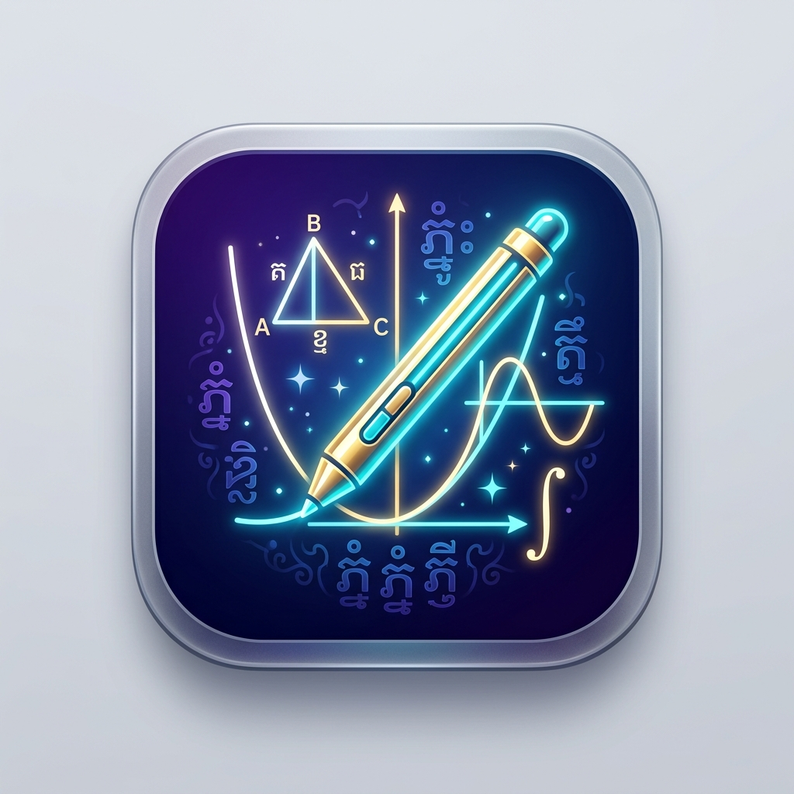

# 🎨 eDraw Khmer (kh-edraw / khedraw)

<p align="center">
  <br><br>
  <b>ក្តារខៀនឌីជីថលឆ្លាតវៃ ជំនួយការបង្រៀន និងចងក្រងគណិតវិទ្យា/រូបវិទ្យាជាមួយ LaTeX, TikZ & Gemini AI</b><br>
  <i>Smart Educational Whiteboard with Full LaTeX, TikZ & Gemini AI Integration for Khmer Educators</i>
</p>

---

## 🌟 លក្ខណៈពិសេសចម្បង (Key Features)

- **📄 ទម្រង់ក្រដាស A4 Portrait ជាលំនាំដើម:**
  - កំណត់ទំហំ A4 Portrait (1080 × 1528 px) គ្រប់ទំព័រ សមស្របសម្រាប់ការកត់ត្រា បង្កើតកម្រងលំហាត់ និងបង្រៀន។
  - គាំទ្រការប្តូរទៅកាន់ A4 Landscape, 16:9 Full HD ឬទំហំផ្ទាល់ខ្លួន។
  - ក្រឡាការ៉ូ (Writing Grid) សម្រាប់ជំនួយក្នុងការសរសេរ និងគូសប្លង់។

- **🤖 ជំនួយការឆ្លាតវៃ Gemini AI (AI Assistant):**
  - **បង្កើតសំណួរស្វ័យប្រវត្តិ:** ជ្រើសរើស (Select) តំបន់លំហាត់គំរូ រួចបញ្ជាឲ្យ Gemini AI បង្កើតសំណួរថ្មីជាទម្រង់ Standalone LaTeX/TikZ ដាក់ចំតំបន់ដែលបានជ្រើសរើសភ្លាមៗ។
  - **គូររូប TikZ ដោយ AI:** បញ្ចូលសំណើរ ឬរូបភាពដើម្បីឱ្យ AI បង្កើតកូដរូបរាងធរណីមាត្រ TikZ ដោយស្វ័យប្រវត្តិ។

- **📐 ការតភ្ជាប់ជាមួយ TeXstudio (TeXstudio Integration):**
  - ប្លង់ TeXstudio Split Layout (កែប្រែកូដ និងមើលលទ្ធផលក្នុងពេលដំណាលគ្នា)។
  - ប៊ូតុង **«🚀 បើក TeXstudio & ចម្លងខ្លឹមសារ»** ដើម្បីបញ្ជូនកូដទាំងអស់ទៅកាន់ TeXstudio ភ្លាមៗ។
  - គាំទ្រកញ្ចប់ `ex_test.sty` ជាមួយពុម្ពអក្សរខ្មែរ (Khmer OS, Noto Sans Khmer)។

- **🖼️ ការគ្រប់គ្រងរូបភាព និង Object (Object & Image Editing):**
  - **បញ្ចូលរូបភាពបានច្រើនវិធី:** តាមរយៈប៊ូតុងលើ Toolbar, Shortcut `Ctrl + I`, Clipboard (`Ctrl + V`), ឬទាញទម្លាក់ (Drag & Drop) ពី Desktop/Finder។
  - **កែប្រែដោយផ្ទាល់ (In-place Edit):** រំកិល (Move), ពង្រីកបង្រួម (Resize with Handles ឬ Mouse Wheel), ស្ទួន (`Ctrl + D`), និងលុប (`Delete`) ដោយមិនបន្សល់ទុកស្នាមចាស់។

- **🇰🇭 ភាសាខ្មែរពេញលេញ (Full Khmer UI):**
  - ម៉ឺនុយ ប៊ូតុង និងប្រអប់សារទាំងអស់ត្រូវបានបកប្រែជាភាសាខ្មែរយ៉ាងផ្ចិតផ្ចង់។

---

## ⌨️ តារាង Shortcut ដំណើរការរហ័ស (Keyboard Shortcuts)

| Shortcut | មុខងារ (Description) |
| :--- | :--- |
| **Ctrl + I** | បញ្ចូលរូបភាព (Insert Image) |
| **Ctrl + C** | ចម្លង Object ដែលបាន Select (Copy) |
| **Ctrl + V** | បិទភ្ជាប់ Object ឬរូបភាព (Paste) |
| **Ctrl + D** | ស្ទួន Object ភ្លាមៗ (Duplicate) |
| **Delete / Backspace** | លុប Object ដែលបានជ្រើសរើស (Delete) |
| **Escape** | ដោះការ Select ឬត្រឡប់មកប៊ិកគូសធម្មតា |
| **Ctrl + Z** | មិនធ្វើវិញ (Undo) |
| **Ctrl + Y** / **Ctrl + Shift + Z** | ធ្វើវិញ (Redo) |
| **P** | ជ្រើសរើសប៊ិកសរសេរ (Pen) |
| **H** | ជ្រើសរើសប៊ិកហាយឡាយ (Highlighter) |
| **E** | ជ័រលុប (Eraser) |
| **S** | ឧបករណ៍ជ្រើសរើស (Select Tool) |
| **T** | ឧបករណ៍វាយអក្សរ (Text/Markdown Tool) |
| **Ctrl + 0** | សមល្មមផ្ទាំង Canvas (Fit Window) |
| **Ctrl + +** / **Ctrl + =** | ពង្រីកមើលជិត (Zoom In) |
| **Ctrl + -** | បង្រួមមើលឆ្ងាយ (Zoom Out) |
| **PageDown** | ប្តូរទៅស្លាយបន្ទាប់ (Next Slide) |
| **PageUp** | ប្តូរទៅស្លាយមុន (Previous Slide) |
| **Ctrl + S** | រក្សាទុក / នាំចេញជា PDF (Export PDF) |
| **Ctrl + O** | បើកឯកសារ (Open File) |
| **Ctrl + G** | សួរ Gemini AI បង្កើតសំណួរ (AI Questions) |
| **F11** | បើក/បិទ ពេញអេក្រង់ (Toggle Fullscreen) |

---

## 🚀 ការដំឡើង និងដំណើរការ (Installation & Setup)

### ១. តម្រូវការប្រព័ន្ធ (Prerequisites)
- **Python:** ជំនាន់ 3.10 ឬខ្ពស់ជាងនេះ
- **LaTeX (ស្រេចចិត្ត សម្រាប់មុខងារចងក្រងរូបមន្ត/TikZ):** MacTeX / TeX Live (XeLaTeX, pdfLaTeX)
- **TeXstudio (ស្រេចចិត្ត):** សម្រាប់មុខងារបើកកូដទៅកាន់ TeXstudio ផ្ទាល់

### ២. របៀបដំណើរការ (How to Run)
1. Clone repository នេះមកកាន់កុំព្យូទ័ររបស់អ្នក៖
   ```bash
   git clone https://github.com/Krotreaksmey2200/kh-edraw.git
   cd kh-edraw
   ```

2. ចូលទៅកាន់ថត `eDraw_project` និងដំឡើងបណ្ណាល័យចាំបាច់៖
   ```bash
   cd eDraw_project
   pip install -r requirements.txt
   ```
   *(ឬដំឡើង PyQt6, google-genai, PyMuPDF, requests)*

3. បើកដំណើរការកម្មវិធី៖
   ```bash
   python3 main.py
   ```

4. 💿 ការបង្កើត macOS DMG Installer (`khedraw.dmg`):
   ```bash
   python3 build_dmg.py
   ```
   *(វានឹងបង្កើតឯកសារ `khedraw.dmg` ដែលអាចបើកឡើងរួច Drag & Drop `khedraw.app` ចូលទៅកាន់ `/Applications` លើ macOS ភ្លាមៗ)*

---

## 📂 រចនាសម្ព័ន្ធគម្រោង (Project Structure)

```text
kh-edraw/
├── README.md                 # ឯកសារណែនាំគម្រោង
├── build_dmg.py              # Script សម្រាប់ build macOS Drag-and-Drop .dmg Installer
├── build_pkg.py              # Script សម្រាប់ build macOS .pkg Installer
├── .gitignore                # កំណត់ឯកសារដែលមិនបញ្ចូលទៅក្នុង Git
└── eDraw_project/            # កូដប្រភពនៃកម្មវិធីចម្បង
    ├── main.py               # ចំណុចចាប់ផ្តើមនៃកម្មវិធី (Entry Point)
    ├── main_window.py        # ផ្ទាំងបង្អួចមេ (Main Window)
    ├── assets/               # រូបតំណាងកម្មវិធី (Logo & Icons: .icns, .png)
    ├── actions/              # Mixins សម្រាប់គ្រប់គ្រងសកម្មភាព (AI, Files, Modes...)
    ├── config/               # គំរូ LaTeX, TikZ និងស្ទីល (Templates & Preamble)
    ├── core/                 # ម៉ាស៊ីនគំនូរ, LaTeX Engine, Gemini AI integration
    ├── dialogs/              # ផ្ទាំង Dialog ផ្សេងៗ (Settings, Preamble, AI Tools...)
    ├── models/               # Model ផ្ទុកទិន្នន័យស្លាយ និង Object គំនូរ
    ├── ui/                   # Mixins បង្កើតផ្ទាំង UI, របារឧបករណ៍ និងរូប Icon
    └── widgets/              # ផ្ទាំង Canvas សម្រាប់គូស និងបង្ហាញរូបភាព
```

---

## 📄 អាជ្ញាប័ណ្ណ (License)
គម្រោងនេះត្រូវបានបង្កើតឡើងសម្រាប់ជាប្រយោជន៍ដល់វិស័យអប់រំ និងការបង្រៀននៅកម្ពុជា។
